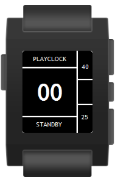
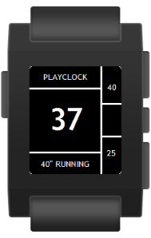
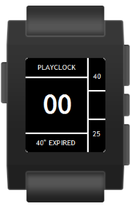
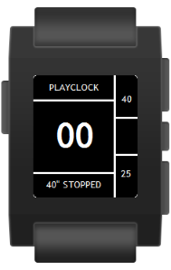
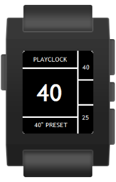
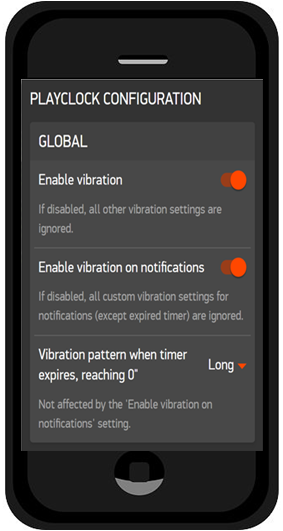
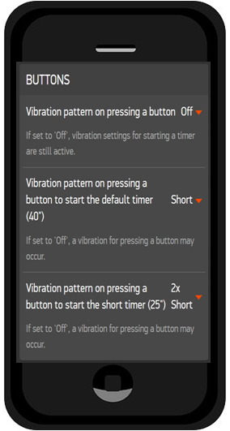
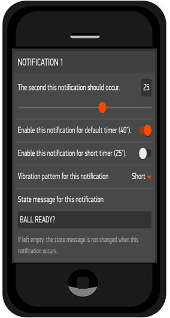

# PlayClock
by Michael Krenn, American Football official in Austria.

Playclock for American Football officials working as on-field timekeeper based on the NCAA Rules 2016.

With this watchapp it is possible to operate the 40/25 on the field without taking a look at the watch and missing action. It works offline although most of the settings like notifications and vibration patterns are customizable via phone when connected.

Pressing the up- or down-button starts the 40- or 25-second countdown, giving a vibration signal as confirmation.  
Pressing one of these buttons long allows to preset the timer, starting it with the select-button.  
Pressing the select-button long stops the current countdown or activates standby-mode, which allows to enable/disable vibration using the select-button again.

5 notifications can be configured individually. Per default the playclock sends a vibration signal when 25 seconds left (ball ready?), at 10 and 5 seconds and, of course, when the timer expires.

## How it works
The back-button (the one on the left side) always closes the Playclock watchapp, so be careful not pressing it accidentally!

The 3 buttons on the right side always works as follows unless noted at the different state descriptions:

#### UP-Button (*1x short vibe*)
Starts 40" countdown (new state: *40" RUNNING*)
#### UP-Button pressed long
Presets timer to 40", not running (new state: *40" PRESET*)
#### SELECT-Button
Disabled - no action
#### SELECT-Button pressed long
Set PlayClock back to standby (new state: *STANDBY*)
#### DOWN-Button (*2x short vibes*)
Starts 25" countdown (new state: *25" RUNNING*)
#### DOWN-Button pressed long
Presets timer to 25", not running (new state: *25" PRESET*)

The timer can have the following states:

### STANDBY (start screen)

#### SELECT-Button
Vibration signals can be enabled / disabled immediately without connecting to the phone.

### 40" RUNNING

#### SELECT-Button pressed long
Stops 40" countdown (new state: *40" STOPPED*)

### 40" EXPIRED (*1x long vibe*)

### 40" STOPPED

### 40" PRESET

#### SELECT-Button (*1x short vibe*)
Starts 40" countdown (new state: *40" RUNNING*)

### 25" RUNNING / 25" EXPIRED / 25" STOPPED / 25" PRESET
The 25 second countdown works the same way as described for the 40 second countdown.

## Notifications
At least up to 5 notifications can be configured via smartphone. The following 3 notifications are set by default:

### BALL READY? (*1x short vibe*)
When the timer reads *25*, the state message changes from *40" RUNNING* to *BALL READY?* and a notification (one short vibration) is sent.  
Of course this happens only when the default timer (40 seconds) is running.

### 10" WARINING! (*2x short vibe*)
When 10 seconds left, the state message *10" WARNING!* is displayed and a notification (two short vibrations) is sent.

### 5" WARINING! (*2x short vibe*)
When 5 seconds left, the state message *5" WARNING!* is displayed and a notification (two short vibrations) is sent.

## Settings
On the smartphone the vibration patterns, notifications and other features of the PlayClock can be configured very easily. Note that there is only communication from the smartphone to the Pebble watch implemented, not the other way! So enabling / disabling the vibration on the Pebble (SELECT-Button pressed in standby mode) is overwritten when the settings on the smartphone are saved the next time.

***

# PlayClock
von Michael Krenn, American Football Schiedsrichter in Österreich.

Uhr für American Football Schiedsrichter, die am Feld für die PlayClock verantwortlich sind, basierend auf den NCAA Rules 2016.

Mit dieser Watchapp ist es möglich, die PlayClock am Feld zu betreiben, ohne auf die Uhr zu sehen und Vorgänge am Spielfeld zu verpassen. Die Uhr funktioniert ohne Verbindung zum Handy, trotzdem die meisten Einstellungen wie Benachrichtigungen und Vibrationsmuster via Handy veränderbar sind, wenn eine Verbindung besteht.

Den oberen oder unteren Knopf zu drücken startet den 40- oder 25-Sekunden Countdown und sendet ein Vibrationssignal als Bestätigung.  
Drückt man einen dieser Knöpfe länger, kann der jeweilige Countdown voreingestellt und mit dem mittleren Knopf gestartet werden.  
Wird der mittlere Knopf länger gedrückt, stoppt der Countdown oder der Standby-Modus wird aktiviert, in welchem die Vibration durch erneutes Drücken dieses Knopfes ein- und ausgeschaltet werden kann.

5 Benachrichtigungen können individuell eingestellt werden. Standardmäßig sendet die PlayClock ein Vibrationssignal wenn 25 Sekunden verbleiben (ball ready?), bei 10 und 5 Sekunden und natürlich auch, wenn der Countdown abgelaufen ist.

## Wie funktionierts?
Der Zurück-Knopf (jener auf der linken Seite) schließt immer die PlayClock Watchapp, daher ist Vorsicht geboten, ihn nicht unabsichtlich zu drücken.

Die 3 Knöpfe auf der rechten Seite funktionieren immer wie folgt, außer es ist bei den einzelnen Zuständen etwas anderes beschrieben:

#### Knopf oben (*1x kurze Vibration*)
Startet den 40" Countdown (neuer Zustand: *40" RUNNING*)
#### Knopf oben lange gedrückt
Stellt die Uhr auf 40", sie läuft jedoch nicht (neuer Status: *40" PRESET*)
#### Knopf in der Mitte
Deaktiviert - kein Ereignis
#### Knopf in der Mitte lang gedrückt
Setzt die Uhr zurück in den Standby-Modus (neuer Zustand: *STANDBY*)
#### Knopf unten (*2x kurze Vibrationen*)
Startet den 25" Countdown (neuer Status: *25" RUNNING*)
#### Knopf unten lange gedrückt
Stellt die Uhr auf 25", sie läuft jedoch nicht (neuer Status: *25" PRESET*)

Die Uhr kann folgende Zustände haben:

### STANDBY (Start-Ansicht)

#### Knopf in der Mitte
Vibrationssignale können sofort ein- / ausgeschaltet werden, ohne mit dem Handy verbunden sein zu müssen.

### 40" RUNNING

#### SELECT-Button pressed long
Stoppt den 40" Countdown (neuer Status: *40" STOPPED*)

### 40" EXPIRED (*1x lange Vibration*)

### 40" STOPPED

### 40" PRESET

#### Knopf in der Mitte (*1x kurze Vibration*)
Startet den 40" Countdown (neuer Status: *40" RUNNING*)

### 25" RUNNING / 25" EXPIRED / 25" STOPPED / 25" PRESET
Der 25-Sekunden Countdown funktioniert gleichermaßen wie für den 40-Sekunden Countdown beschrieben.

## Benachrichtigungen
Bis zu 5 Benachrichtigungen können am Handy konfiguriert werden. Die folgenden 3 Benachrichtigungen sind standardmäßig gesetzt:

### BALL READY? (*1x kurze Vibration*)
Sobald die Uhr *25* anzeigt, ändert sich die Nachricht von *40" RUNNING* auf *BALL READY?* und eine Benachrichtigung (eine kurze Vibration) wird gesendet.  
Natürlich passiert dies nur, wenn die 40-Sekunden-Uhr läuft.

### 10" WARINING! (*2x kurze Vibrationen*)
Wenn noch 10 Sekunden auf der Uhr sind, wird die Nachricht *10" WARNING!* angezeigt und eine Benachrichtigung (zwei kurze Vibrationen) wird gesendet.

### 5" WARINING! (*2x kurze Vibrationen*)
Wenn noch 5 Sekunden auf der Uhr sind, wird die Nachricht *5" WARNING!* angezeigt und eine Benachrichtigung (zwei kurze Vibrationen) wird gesendet.

## Einstellungen
Am Handy können die Vibrationsmuster, Benachrichtigungen und andere Funktionen der PlayClock sehr einfach konfiguriert werden. Beachten Sie, dass nur Kommunikation vom Handy zur Pebble-Uhr eingerichtet ist, nicht anders herum! Somit wird die Aktivierung / Deaktivierung der Vibration (Knopf in der Mitte wird im Standby-Modus gedrückt) auf der Pebble überschrieben, sobald die Einstellungen am Handy das nächste mal gespeichert werden.

